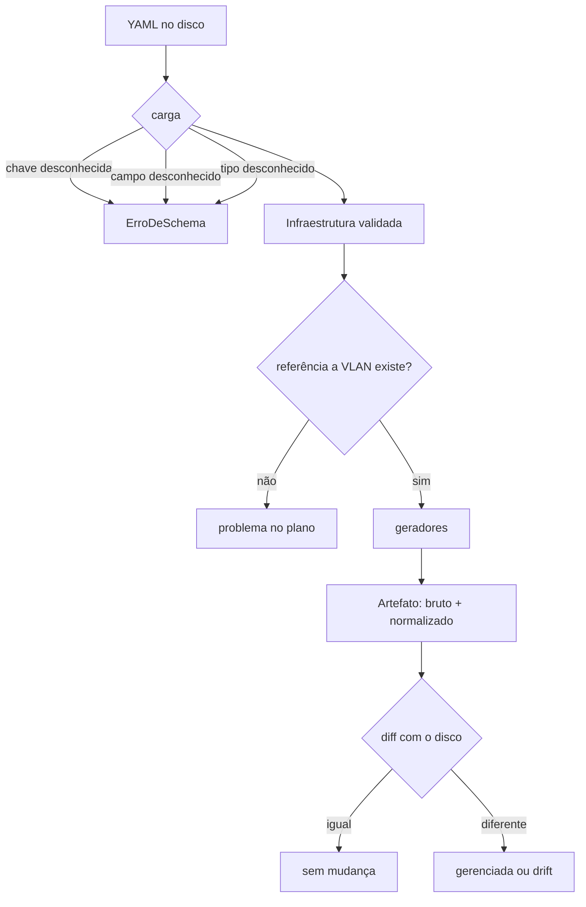

# O modelo declarativo

O schema de `iaclab` é a resposta a uma pergunta que aparece na segunda
semana de uso de qualquer ferramenta de IaC: **o que eu posso escrever no
arquivo?**

Um YAML aceito pelo parser e rejeitado pelo gerador é a pior combinação
possível. O arquivo passa no commit, passa na revisão, e falha na hora de
gerar — com três equipamentos já escritos e o quarto quebrado. Por isso a
validação acontece **na carga**, antes de qualquer geração.



## As três camadas de recusa

A validação não é uma coisa só. Ela existe em três lugares, e cada um pega
uma classe diferente de erro.

**1. Chave de topo** (`cargador.py`). Uma chave que não existe no schema é
erro de digitação quase sempre — `equipamntos:` com o `a` trocado. A chave
desconhecida é recusada em vez de ignorada, porque ignorar significa que o
inventário inteiro desapareceu do plano sem erro nenhum.

**2. Campo de equipamento** (`modelo.py`, `CAMPOS_POR_TIPO`). Cada tipo tem
uma lista fechada de campos aceitos. Campo fora da lista é recusado pelo
mesmo motivo: o gerador não conhece o campo, e um equipamento sai sem a
configuração que o YAML pediu.

**3. Coerência** (cada gerador, `validar()`). Aqui o arquivo está bem
formado e o erro é de inventário: uma porta em access apontando para a VLAN 99,
que não existe; uma regra de firewall cujo destino é uma zona que o próprio
firewall não declara; um usuário em um grupo que o servidor não tem.

A distinção importa porque **a forma de corrigir é diferente**. Erro de schema
se corrige no código; erro de coerência se corrige no YAML. Misturar os dois
níveis faz o usuário procurar no lugar errado.

## Por que a lista de campos é fechada

```python
CAMPOS_POR_TIPO: dict[str, tuple[str, ...]] = {
    "switch": ("hostname", "modelo", "vlan", "portas", "stp", "semente", "descricao"),
    "firewall": ("hostname", "modelo", "vlan", "zonas", "regras", "nat", "descricao"),
    "ap": ("hostname", "modelo", "vlan", "ssid", "canal", "sinal", "descricao"),
    "servidor": ("hostname", "sistema", "grupos", "usuarios", "permissoes", "descricao"),
}
```

Uma lista aberta — aceitar o que vier e descartar o que o gerador não conhece
— é mais cômoda no dia em que se escreve e é a causa de metade dos incidentes
de IaC depois. O campo `vlan_nat` que ninguém implementou passa pelo schema,
não aparece no arquivo gerado, e alguém passa uma semana achando que a VLAN
foi configurada.

O teste `test_campos_do_projeto_batem_com_o_schema` fecha o ciclo: ele lê os
YAMLs reais do projeto e falha se algum campo usado neles estiver fora do
schema. Divergência entre dados e schema não pode passar em silêncio.

## Os campos, por tipo

### switch

| Campo | Para que serve |
|---|---|
| `hostname` | identificação, obrigatória |
| `modelo` | aparece como comentário no arquivo |
| `vlan` | VLAN de gerenciamento |
| `portas` | lista de `nome`, `modo`, `vlan`, `descricao`, `trunks` |
| `stp` | `modo`, `prioridade_bridge`, `portfast`, `bpdu_guard` |
| `semente` | usado pelo projeto vizinho, não pelo gerador |
| `descricao` | vira comentário no arquivo |

`portas` é onde mora a diferença entre `access` e `trunk`, e a validação é
diferente para cada: access exige uma VLAN declarada; trunk exige uma lista
`trunks`, e cada VLAN da lista tem que existir.

O `trunk` gera o VLAN nativo por último de propósito. Quando um trunk aceita
uma lista, o equipamento assume o primeiro elemento como nativo, e essa
suposição silenciosa é do tipo que derruba uma rede num dia comum.

### firewall

| Campo | Para que serve |
|---|---|
| `zonas` | `nome`, `interfaces`, `vlan` |
| `regras` | `nome`, `origem`, `destino`, `acao`, `porta` |
| `nat` | `nome`, `tipo`, `zona_origem`, `interface_destino` |

A regra de validação mais específica do firewall é a de referência cruzada:
`origem` e `destino` precisam ser **nomes de zona declarados no mesmo
equipamento**. Um firewall que declara uma regra para uma zona que ele não
tem é um arquivo que genera comando para uma zona inexistente.

### ap

| Campo | Para que serve |
|---|---|
| `ssid` | lista de `nome`, `vlan`, `seguranca`, `oculta` |
| `canal` | inteiro de 1 a 11 |
| `sinal` | inteiro de 0 a 100 |

`seguranca` aceita `wpa2`, `wpa3` ou `aberta`. Para `wpa2` o gerador escreve
uma chave **literalmente fictícia** e um comentário dizendo que a chave real
vem do cofre. Nenhuma chave de verdade entra no YAML, e um teste varre os
quatro geradores para garantir que nenhum valor de senha foi esquecido lá.

`oculta: true` gera a linha `hidden` com um aviso: esconder o SSID não é
segurança, o beacon continua anunciando a rede.

### servidor

| Campo | Para que serve |
|---|---|
| `grupos` | `nome`, `descricao` |
| `usuarios` | `nome`, `grupos`, `shell`, `comentario` |
| `permissoes` | `caminho`, `grupo`, `modo`, `tipo` |

O gerador de servidor **não emite senha nenhuma**, e há um teste que falha se
a palavra aparecer no arquivo gerado. A pertença a grupo vai no arquivo, sem
segredo: quem audita acesso precisa saber a qual grupo o usuário pertence, e
não precisa de nenhum segredo para isso.

`modo` tem que ser string octal de 3 ou 4 dígitos. `'0750'` com aspas é
string; `0750` sem aspas vira inteiro em base 10 pelo YAML, e `750` perde o
zero à esquerda — que é exatamente o bit de execução do dono.

## A ordem de declaração é a ordem do arquivo

O gerador não reordena. Equipamentos saem na ordem em que foram declarados, e
dentro de cada um as seções saem na ordem do schema: identidade, VLANs,
portas, spanning-tree.

Isso não é detalhe. Um plano que processa equipamentos em ordem de hash muda
de ordem entre execuções, e o diff passa a acusar reordenação como se fosse
mudança de configuração. O critério de aceite — duas execuções dão "sem
mudanças" — depende inteiramente dessa ordem ser fixa.

## O manifesto, e por que ele existe

`saida/gerado/.manifesto.json` guarda o texto que foi gerado na última vez, por
equipamento. Ele responde a uma pergunta que o diff sozinho não consegue:

> O YAML mudou, ou alguém mexeu no arquivo?

Sem o manifesto, as duas situações produzem exatamente a mesma comparação —
o desejado é diferente do atual — e a classificação vira palpite. Com ele, a
decisão é direta: se o que está em disco é igual ao que foi gerado, ninguém
mexu e a diferença vem do YAML. Se é diferente, alguém escreveu no arquivo.

O `docs/dry-run-por-que-importa.md` explica por que essa distinção muda a
resposta do time, e não só a saída do programa.

## Três arquivos, três perguntas

`infra/acessos.yaml` é separado dos outros dois de propósito.

- `rede.yaml` responde **o pacote chega**
- `servidores.yaml` responde **o processo roda**
- `acessos.yaml` responde **esta pessoa pode**

Se a regra estivesse dentro de `servidores.yaml`, mudar um acesso pareceria
mudança de servidor. Não é. Mudança de acesso é mudança de acesso, e no diff
precisa aparecer como tal.

## Referência rápida

```powershell
python -m iaclab regras
```

Lista os tipos aceitos e os campos de cada um, direto do código — a mesma
fonte que a validação usa.